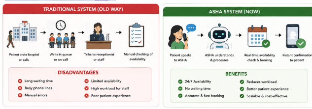
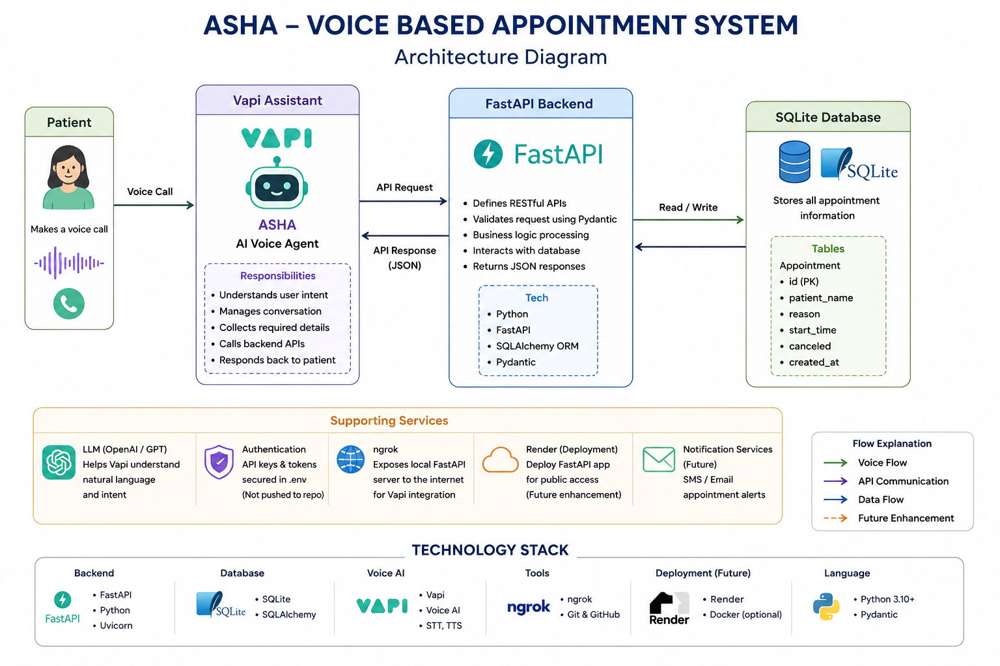
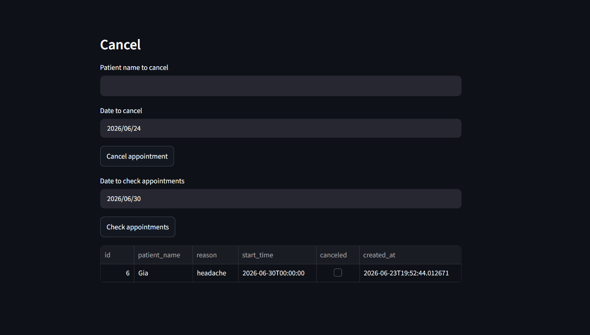
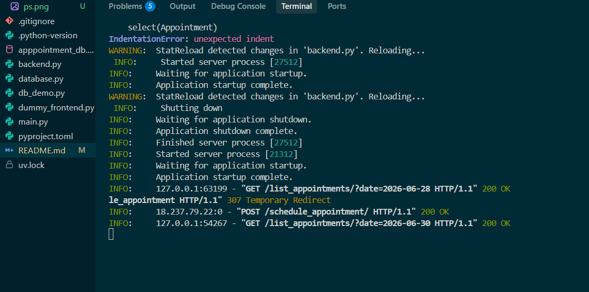
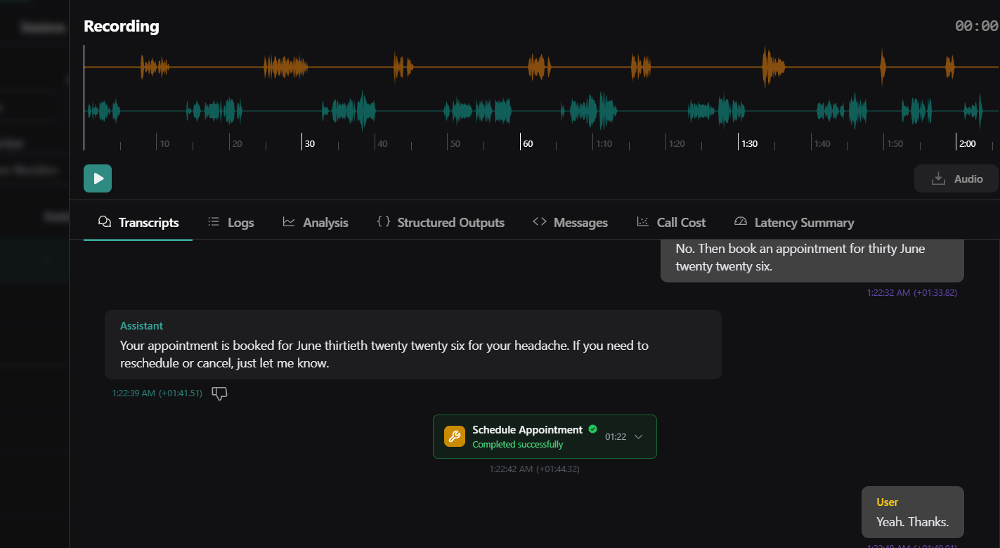
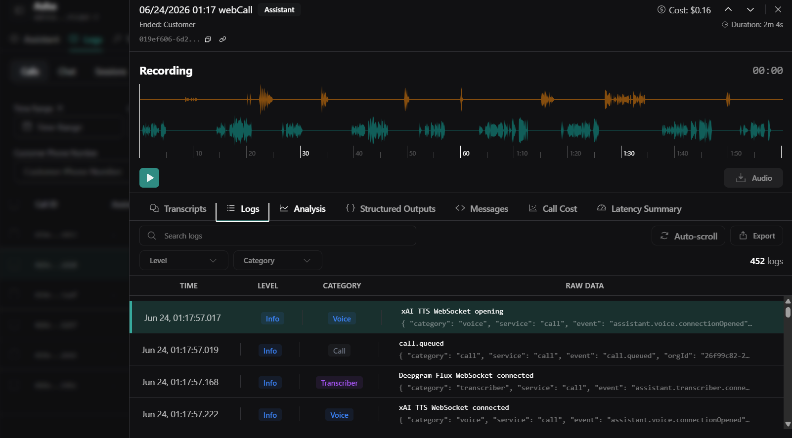

# 🏥 ASHA - Voice Based Appointment System

## 📌 Problem Statement

Traditional hospital appointment booking systems are often inefficient, time-consuming, and inaccessible for many patients. Patients frequently encounter long waiting times, busy phone lines, manual booking errors, and limited access to appointment information. Hospital staff spend significant time managing appointment requests, leading to increased operational workload and reduced efficiency.

### Challenges in Traditional Systems

- Long waiting times on calls and at reception desks
- Manual appointment booking prone to human errors
- Limited appointment availability information
- High dependency on hospital staff
- Lack of 24/7 support for patients
- Increased operational workload and cost
- Poor patient experience and satisfaction

---

## 🎯 Objective

The objective of ASHA is to build an AI-powered voice assistant that enables patients to:

- Book appointments through natural voice conversations
- Retrieve appointment information instantly
- Cancel appointments easily
- Check doctor availability in real-time

The system aims to reduce manual effort, improve accessibility, and provide a faster and more efficient appointment management experience.

---

# 🏗️ System Overview

ASHA is an AI-powered voice-based hospital appointment assistant built using Vapi, FastAPI, SQLAlchemy, and SQLite. The system allows patients to interact using voice commands while the backend handles appointment scheduling and database operations.

---

# 🏛️ Traditional System Architecture

```text
                    PATIENT
                       │
                       ▼
                Phone Call / Visit
                       │
                       ▼
                Reception Desk
                       │
                       ▼
             Manual Availability Check
                       │
                       ▼
              Manual Appointment Entry
                       │
                       ▼
              Hospital Database
                       │
                       ▼
               Appointment Confirmation
```

### Problems

❌ Long waiting times

❌ Busy phone lines

❌ Human errors

❌ Limited working hours

❌ High staff workload

❌ Poor scalability

---



---

# 🚀 Proposed System Architecture (ASHA)

```text
                    ┌──────────────┐
                    │   Patient    │
                    └──────┬───────┘
                           │
                    Voice Conversation
                           │
                           ▼
              ┌─────────────────────────┐
              │      ASHA (VAPI)        │
              │   Voice AI Assistant    │
              └──────────┬──────────────┘
                         │
                   API Request
                         │
                         ▼
              ┌─────────────────────────┐
              │      FastAPI Backend    │
              │ Business Logic & APIs   │
              └──────────┬──────────────┘
                         │
                  SQLAlchemy ORM
                         │
                         ▼
              ┌─────────────────────────┐
              │     SQLite Database     │
              │     Appointment Data    │
              └─────────────────────────┘
```

---

# 🔄 Data Flow Diagram

```text
1. Patient Speaks
          │
          ▼
2. ASHA (Voice Assistant)
          │
          ▼
3. Understand User Intent
          │
          ▼
4. Call FastAPI Endpoint
          │
          ▼
5. Backend Processes Request
          │
          ▼
6. SQLite Database Operation
          │
          ▼
7. JSON Response Generated
          │
          ▼
8. ASHA Converts Response to Voice
          │
          ▼
9. Patient Receives Response
```

---

<h2>System Architecture</h2>

<p align="center">
  
</p>

---

# ✨ Features

- 🎙️ Voice-Based Appointment Booking
- 📅 Appointment Retrieval
- ❌ Appointment Cancellation
- 🔍 Availability Checking
- 🤖 Conversational AI Experience
- ⚡ Real-Time API Integration
- 🗄️ Persistent Appointment Storage
- 🌐 Public API Access using ngrok
- 🔄 Automated Appointment Management

---

# 📡 Available APIs

| Method | Endpoint | Description |
|----------|----------|-------------|
| POST | /book | Book Appointment |
| GET | /list_appointments | Retrieve Appointments |
| GET | /availability | Check Availability |
| POST | /cancel | Cancel Appointment |

---

# 🗄️ Database Schema

## Appointment Table

| Field | Type |
|---------|---------|
| id | Integer |
| patient_name | String |
| reason | String |
| start_time | DateTime |
| canceled | Boolean |
| created_at | DateTime |

---

# ⚙️ Tech Stack

### Backend
- FastAPI
- SQLAlchemy
- Pydantic
- Uvicorn

### Database
- SQLite

### Voice AI
- Vapi

### Development Tools
- Python
- ngrok
- Git
- GitHub

---

# 📂 Project Structure

```bash
ASHA-Voice-Based-Appointment-System/

├── backend.py
├── database.py
├── main.py
├── schemas.py
├── appointment_db.db
├── requirements.txt
├── README.md
└── .gitignore
```

---

# 🚀 Installation

## Clone Repository

```bash
git clone https://github.com/ananyag309/ASHA-Voice-Based-Appointment-System.git

cd ASHA-Voice-Based-Appointment-System
```

## Install Dependencies

```bash
pip install -r requirements.txt
```

## Run FastAPI

```bash
uvicorn main:app --reload
```

## Open Swagger Documentation

```text
http://localhost:8000/docs
```

---

# 📋 Example Conversation

### Booking Appointment

**Patient:** I want to book an appointment tomorrow.

**ASHA:** Sure. May I know your name?

**Patient:** Ananya Gupta.

**ASHA:** What is the reason for your visit?

**Patient:** General Checkup.

**ASHA:** Your appointment has been successfully booked.

---

<h2>Screenshots</h2>

<table>
<tr>
<td>

</td>
<td>

</td>
</tr>

<tr>
<td>

</td>
<td>

</td>
</tr>
</table>

---

# 📈 Benefits

### For Patients

- Faster appointment booking
- No waiting on calls
- 24/7 assistance
- Better user experience

### For Hospitals

- Reduced staff workload
- Fewer manual errors
- Improved operational efficiency
- Scalable appointment management

---

# 🔮 Future Enhancements

- SMS Notifications
- WhatsApp Reminders
- Email Confirmations
- PostgreSQL Integration
- Streamlit Admin Dashboard
- Doctor-wise Scheduling
- Multi-language Support
- Symptom Collection Agent
- Cloud Deployment on Render

---

# 👩‍💻 Author

### Ananya Gupta

B.Tech Computer Science Engineering  
Bennett University

GitHub: https://github.com/ananyag309

---

⭐ If you found this project useful, consider starring the repository.